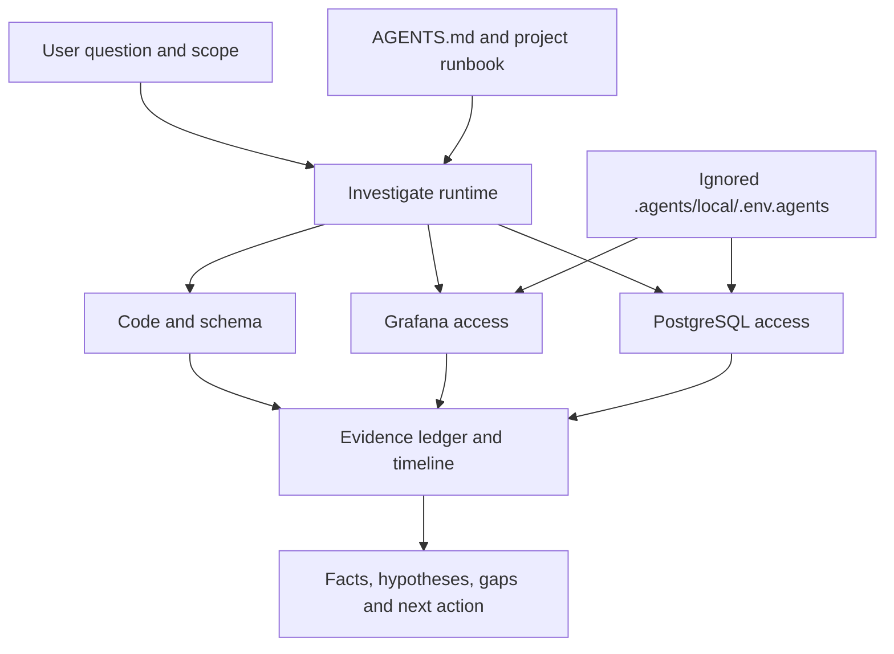

# Investigation as a project contract

I use skills to make the path from a symptom to evidence repeatable. The procedure
travels between projects; environment identity, service mapping and credentials do
not. The access helpers are reusable adaptations of my working scripts, with an
explicit local configuration boundary.



## Consumer setup

A small project-owned AGENTS.md section might say:

```markdown
## Investigations

- Procedure and service/datasource mapping: docs/runbooks/investigation.md
- Credentials: .agents/local/.env.agents (ignored, populated privately)
- Evidence: .agents/local/evidence/ (private, redact before sharing)
- Environment must be stated in the request or resolved from the runbook.
- Use read-only accounts. Repairs and external publication are separate actions.
```

Add `/.agents/local/` to the consumer's `.gitignore` before putting secrets there.
Confirm `git check-ignore .agents/local/.env.agents` succeeds. Ignoring does not
untrack an already committed file: check `git ls-files -- .agents/local/` too.
If a credential was committed, handle rotation and removal through the project's
incident procedure. Restrict the local directory/file permissions as appropriate.
Copy only fictional example keys from the selected skills; fill real values
locally through your normal secret-distribution process.

The shared env file may contain both Grafana and PostgreSQL keys. Each helper
uses only its own configuration, parses it as data and does not shell-source it.
No application .env or ambient credential fallback is used. For multiple
worktrees, populate each deliberately or pass an explicitly documented --env-file;
never infer that the parent checkout's production configuration is correct.

## What stays in the project

The runbook defines environment identity, datasource UIDs, service labels, schema
locations, network/tunnel setup, retention and allowed data access. It may use
existing tools instead of these helpers. Credentials alone do not grant a broader
investigation scope. The Grafana adapter supports password login plus optional
ingress auth; the PostgreSQL adapter uses Node pg and read-only queries. Other
authentication schemes should use a project adapter rather than hidden fallbacks.

## Example question

“Investigate why request example-42 was retried in staging between 10:00 and 10:15
UTC. Read code, relevant logs and persisted state. Do not repair or resend it.”

A useful result distinguishes the code's expected transition, the observed worker
sequence and the state recorded in the database. If the original provider response
is absent, it says so rather than inventing a provider failure from a later retry.
The evidence ledger records exact source, query/window, retrieval time and gaps.
No company service names, accounts, domains or captured production data are
included in this repository.
