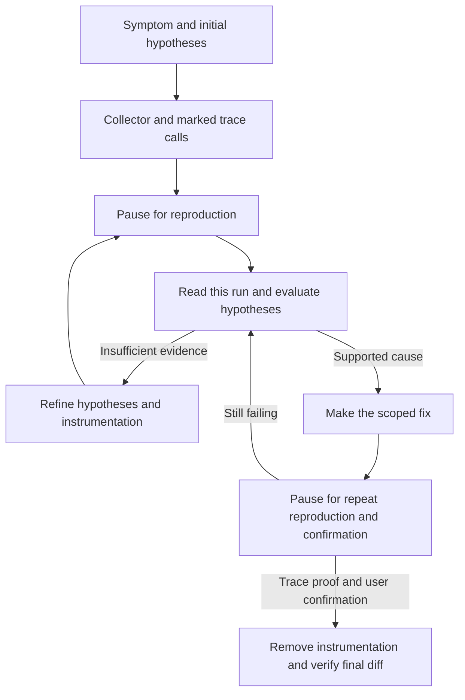

# Project-native debug session

Own the complete debug session: prepare a local collector, instrument the suspected
path, pause for reproduction, analyze evidence, fix, pause for confirmation and
remove the temporary apparatus. Existing logs inform hypotheses; they do not
replace this session protocol. For an inspection-only request, inspect and explain
what instrumentation would require; do not alter the project without authorization.
An explicit request to run this debug mode authorizes its scoped temporary setup.
Follow the user's scope for fixes and retain the interaction gates below.

Read AGENTS.md and the project's launch/debugging runbook. Identify the actual
stack, entrypoints, development commands, evidence location and current changes.
The collector and emitters are written in the **consumer project's stack**. Python
is the runtime of this collection's shipped helpers, not a requirement to insert
Python into a TypeScript, Go or other application.

## Session lifecycle

## 1. Define the case and ownership

Record exact input/action, entrypoint, expected outcome, broken state and an
observable failure predicate. Read the code path and state a small set of
falsifiable hypotheses; identify which values/events distinguish them.

Choose a unique session ID and start a session manifest in the project's ignored
local evidence directory. Record the current phase, hypotheses, reproduction
steps, collector endpoint/output, run IDs and owned changes. Use
[the instrumentation contract](references/instrumentation.md) for markers,
manifest fields and safe cleanup. Preserve unrelated dirty work from the start.

## 2. Build the project-native collector

Choose and explain one of these implementations based on the actual project:

- **Integrated route:** add a temporary development-only POST route using the
  application's normal routing mechanism, such as a Next.js route handler.
- **Companion server:** start a temporary local server alongside the application,
  written in its stack, when an integrated route is impractical or unavailable.

Both collect structured events into a fixed ignored JSONL file for this session.
Reuse suitable existing project code where useful, but record what predates this
session so it survives cleanup. Do not silently substitute ordinary console logs
or an agent-owned external collector. If neither implementation is possible,
explain the constraint and agree an alternative before changing the protocol.

Enable the collector only for this local session. Restrict its callers to the
intended session/origin, bind a companion server to loopback and avoid wildcard
CORS. Bound payload size, file growth and runtime. Never accept an output path
from a caller. Do not collect secrets, cookies or unnecessary personal payloads.

Start with the project's runbook commands and record the process/task handle for
anything launched. Smoke-test a synthetic event from the actual instrumented
runtime into JSONL. A listening port alone does not prove browser-to-route delivery
through CORS/CSP, authentication or dev-server routing. Separate smoke events from
reproduction evidence.

## 3. Instrument the hypotheses

Insert small, marked trace calls at decision points and lifecycle boundaries. In
browser code use best-effort fetch POSTs to the collector; in server/native code
use the project's HTTP client equivalent. Capture input state and effective output,
not just function entry. Include session ID, run ID, hypothesis ID, event name,
source location and relevant sanitized fields. Include per-source sequence or
monotonic time when ordering matters; do not infer global ordering from HTTP arrival.

Keep traces separate from fix logic and mechanically identifiable under the
instrumentation contract. Do not await trace delivery in the application control
flow or let collector failures change the business result. Account for observation
overhead, event loss, out-of-order delivery and timing-sensitive bugs.

## 4. Pause for reproduction

State that instrumentation is ready. Give the exact entrypoint, steps, active run
ID and what the user should report. **Stop and wait** for the user to reproduce;
do not sleep for an arbitrary duration or infer reproduction from silence.
If the user explicitly delegates reproduction to the agent, execute those steps
with available tools and record the actual observation instead of requesting a
redundant human run. Do not replace manual reproduction with an unrelated smoke test.

Retain the manifest so a later turn can resume the same session. When reproduction
is reported, inspect the matching run. If the expected events are missing, check
the tracing path; an empty file is not proof that the bug disappeared.

## 5. Analyze and iterate

Parse the run and tie observations to each hypothesis: supported, rejected or
unresolved. Compare failing and successful paths where available; distinguish
transient states from the defined failure predicate. Reference concrete events.

If evidence is insufficient, explain the gap, refine the hypotheses and marked
instrumentation, allocate a fresh run ID and return to the reproduction pause.
Do not repeatedly ask for the same run without a reason or guess a fix merely to
move the session forward.

## 6. Fix, then pause for confirmation

Make the smallest authorized fix supported by evidence. Keep instrumentation in
place for verification and allocate a fresh post-fix run. Ask the user to repeat
the original steps and report whether the symptom is gone; pause again. Agent-run
reproduction, when delegated, supplies evidence but does not silently stand in for
user confirmation. If human acceptance is explicitly waived, record that waiver.

Read fresh traces and evaluate the **same** failure predicate. Require both trace
support and user confirmation (or its explicit waiver) before successful cleanup.
If the user reports success but traces are missing, establish evidence. If traces
look good but the user still sees the problem, continue investigation. Never clean
up just because compilation passed or the page now loads. Add a focused regression
test when it meaningfully protects the demonstrated behavior.

## 7. Clean up and close

After confirmation, remove the session-owned apparatus using the manifest and
markers: emitters, temporary helper imports, route/server, local flags/config,
launch artifacts and raw traces unless retention was requested. Stop only the
owned process after checking its identity. Preserve the actual fix and unrelated
work; do not reset files or remove whole directories indiscriminately.

Search for the session ID, marker pairs, collector URL and helper references.
Inspect the final diff and run relevant checks with instrumentation removed;
verify the collector is no longer available and normal app behavior still works.
Report reproduction, evidence, fix, confirmation and cleanup separately.

If interrupted, leave the manifest at its actual phase and list remaining artifacts;
stop an owned collector when it is no longer needed or cannot be supervised. Do not
call the session resolved. A user cancellation/cleanup request may end the session
without fix confirmation: remove owned instrumentation, preserve the agreed code
changes and report the unresolved outcome. Never publish temporary debugging
apparatus as part of the fix. This skill adds no deployment or reviewer gate.
